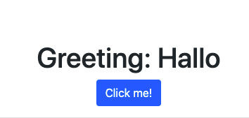
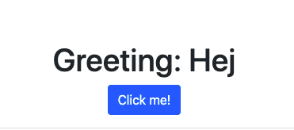
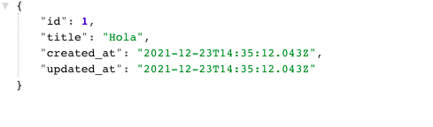

# Set up a "Hello world" project with rails-react gem

- In this project I implemented a connection between a Ruby on Rails back-end and React front-end.


## Built With

- Ruby 3.0.3
- Ruby on Rails 
- React
- Redux
- sqlite3
- PostgreSQL
- Rubocop

## Linters

- Rubocop
- Stylelint


## 


## Getting Started

To get a local copy up and running follow these simple example steps.


### Setup


```
 npm install
 bundle install
```

Setup database with:

```
 rails db:create
 rails db:migrate
 rails db:seed
```

### Usage

Start server:

```
rails s
```

Open `http://localhost:3000/` in your browser.
Open `http://localhost:3000/greeting` in your browser to see a random JSON greeting.


## API Endpoints

> Random JSON greeting 

```http://127.0.0.1:3000/v1/greetings```

## 


## Author


👤 **Amal Hersi**

- GitHub: [Amal Hersi](https://github.com/Amalcxc)

- Twitter: [@Amalcx4](https://twitter.com/home?lang=en)

- LinkedIn: [Amal Hersi](https://www.linkedin.com/in/amal-hersi-a29583205/)


## 🤝 Contributing

Contributions, issues and feature requests are welcome!

Feel free to check the [issues page](https://github.com/Amalcxc/hello-rails-react/issues).

## Show your support

Give a ⭐️ if you like this project!
